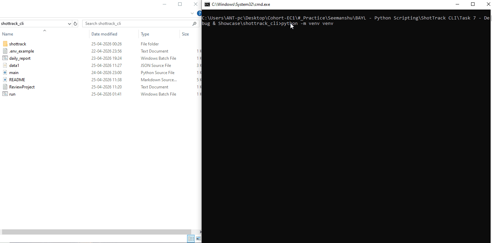

# VFX ShotTrack CLI Tool

## Project Description
ShotTrack CLI is a Python command-line tool for managing VFX shots, including notes, tasks, and statuses. Have different commands that can be exexuted from CLI and also directly running the .bat files. Built for artists, leads, and small teams who want a simple way to track shot progress without heavy production software.

## Features
- Add and manage shots
- Track shot status (not_started, in_progress, review, approved, hold)
- Add and view notes per shot
- Create, update, and delete tasks
- Filter shots by status
- Export a daily production report (Markdown)
- Run commands via CLI or .bat shortcuts

## 🧠 Shot Rules
- Shot Can Only start with Only ```SH```. Padding must be less than equal to 3 digits
- Example: SH010, SH101
- Allowed status for shots : ```ALLOWED_STATUS = ["not_started", "in_progress", "review", "approved", "hold"]```

## 📦 Installation

#### Add Environment Variables
- Add a system variable `SHOT_DATA_FILE`=`filename.json`
- This can be with folder `data\data.json`
- The Json shot data file will be created in this folder 
- This is a script relative path.

#### Create Virtual Environment
```python -m venv venv```

#### Activate (Windows)
```venv\scripts\Activate```

##### Create Environment 



## Usage
### CLI Commands
#### Adding New Shot:
```
python main.py help
python main.py add-shot SH010
```


#### Adding Notes, View notes: 
```
python main.py set-status SH010 review
python main.py add-note SH010 "Need better edge cleanup"
python main.py view-notes SH010
```


#### Adding, Delete , Change status for tasks:
```
python main.py add-task SH010 "Roto cleanup"
python main.py done-task SH010 1
python main.py delete-task SH010 2   
```


#### List Shot Details:
```
python main.py list-shots   
python main.py list-shots --pending
python main.py list-shots --review
python main.py list-shots --done
```


#### Export report as daily_report.md
```
python main.py export-report 
```


#### Using Batch File (Windows)
An Automatic .bat file is already setup which is cable of taking all the valid command and arguments and running the CLI tool.

```
run.bat list-shots
run.bat help
run.bat add-shot SH010
run.bat list-shots
run.bat set-status SH010 review
run.bat add-note SH010 "Need better edge cleanup"
run.bat set-status SH100 approved
run.bat view-notes SH010
run.bat add-task SH010 "Roto cleanup"
run.bat done-task SH010 1
run.bat delete-task SH010 2      
run.bat list-shots --pending
run.bat list-shots --review
run.bat list-shots --done
run.bat export-report
```

## Folder Structure
```
shottrack_cli/
├── main.py
├── README.md
├── daily_report.md
├── run.bat
├── daily_report.bat
├── .env_example.txt
└── shottrack/
    ├── __init__.py
    ├── cli.py
    ├── commands.py
    ├── storage.py
    ├── validators.py
    ├── constants.py
    ├── config.py
    └── exporter.py
```

###  Data Format
Each shot should now look like this inside .json:
```json
[
    {
        "shot_code": "SH010",
        "status": "not_started",
        "notes": [
            "Need updated plate from client"
        ],
        "tasks": [
            {
                "id": 1,
                "title": "Roto cleanup",
                "status": "pending"
            },
            {
                "id": 2,
                "title": "Paint wire removal",
                "status": "done"
            }
        ]
    }
]
```

#### 📄 Markdown Exporter

* Generate a daily report::
    ```text
    python main.py export-report
    ```
    * This command creates daily report file named: `daily_report.md`
* **What the exporter do**
    * It should read all shot data from the JSON file and write a Markdown report and save it in the `SHOT_DATA_FILE`.

        ```markdown
        # Daily Shot Report

        ## SH010
        - Status: review
        - Notes Count: 2
        - Pending Tasks: 1
        - Done Tasks: 1

        ## SH020
        - Status: approved
        - Notes Count: 0
        - Pending Tasks: 0
        - Done Tasks: 2
        ```

#### 📌 Batch Files
* **`run.bat`**
    * This batch file should allow students to run any CLI command more quickly.
    * Usage:
        ```
        run.bat list-shots
        run.bat add-shot SH050
        ```
* **`daily_report.bat`**
    * This batch file should generate the markdown report quickly.
        * Usage:
            * double-click the file
            * or run it from terminal

## 🎯 Why ShotTrack CLI?

Unlike heavy production tools, ShotTrack CLI is:

1. Lightweight ⚡
2. Easy to set up 🛠️
3. Fully local (no server required)

### 📌 Future Improvements
1. Shot assignment (artists)
2. Due dates & deadlines
3. CLI color output

## 📜 License

> MIT License