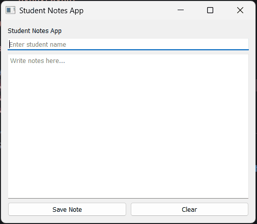

## Task 1 - Build Student Notes App UI

### ✔️ Objective
Build a simple Student Notes App UI with the following structure:

### ✔️ Requirements
Build a Python script that includes the following:
* Create a main `QWidget` window.
* Add a title using `QLabel` → “Student Notes App”.
* Add a `QLineEdit` for entering student name.
* Add a `QTextEdit` for writing notes.
* Add two buttons:
    * Save Note
    * Clear
* Use only:
    * `QVBoxLayout`
    * `QHBoxLayout`
* No classes allowed.
* Everything should be written directly in the Python script.

### ✔️ Learning Goal
By completing this task, you will practice:
* Creating a PySide2 window
* Using basic widgets
* Arranging widgets with layouts

### ✔️ Sample Output

