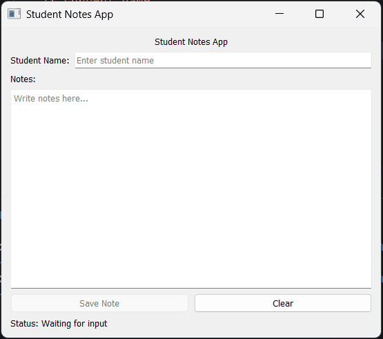

## Task 2 - Improve UI with Nested Layouts

### ✔️ Objective
Improve the existing UI by using **nested layouts**, **signals and slots**, and **basic widget functions**.

### ✔️ Requirements
* Update the previous application with the following improvements:
* Keep the same app structure from TASK 1:
    * Title label
    * Student name input
    * Notes text area
    * Save button
    * Clear button
* Use nested layouts properly:
    * Put the title in its own layout
    * Put the student name label and input in one horizontal layout
    * Put the notes label and text edit in a vertical layout
    * Put the buttons in a horizontal layout
    * Add all of these inside one main vertical layout
* Add one more `QLabel` at the bottom for status messages:
    * Example default text: `"Status: Waiting for input"`
* Use signals and slots:
    * When the Save Note button is clicked:
        * Update the status label to show that the note was saved
    * When the Clear button is clicked:
        * Clear the `QLineEdit`
        * Clear the `QTextEdit`
        * Update the status label
    * When the user types in the name field:
        * Update the status label with the current name
    * When the text inside `QTextEdit` changes:
        * Enable the Save button only when there is some note text
* Use basic widget functions:
    * `setText()`
    * `setEnabled()`
    * `setPlaceholderText()`
    * `setAlignment()`
* Do not use classes.
* Write everything directly in one Python script.

### ✔️ Learning Goal
By completing this task, you will practice:
* Using nested layouts
* Connecting signals and slots
* Updating widgets based on user actions
* Using basic widget functions in PySide2

### ✔️ Sample Output
