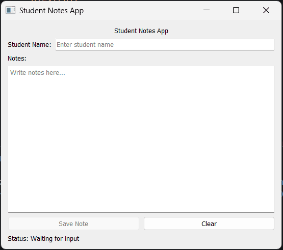

## Task 3 - Refactor to Class Structure

### ✔️ Objective
Take the existing working application and reorganize it using the standard PySide2 application structure taught in class.

### ✔️ Requirements
Update the **Student Notes App** from TASK 2 by converting the entire application into a proper PySide2 class-based structure.
* Create a class named `MainWindow`.
* Inherit from `QWidget`.
* Move all widget creation code inside the class.
* Create a method named `initUI()` and place all UI-related code inside it.
* Keep the application features from task 2:
    * Title label
    * Student name input
    * Notes text area
    * Save button
    * Clear button
    * Status label
    * Nested layouts
    * Signals and slots
    * Widget functions
* Keep the logic working exactly as before.
* Add the standard:
```python
if __name__ == "__main__":
```
* block at the bottom.
* Inside that block:
    * Create the QApplication
    * Create the MainWindow
    * Show the window
    * Run the application

### ✔️ Learning Goal
By completing this task, you will practice:
* Creating a class in PySide2
* Organizing code inside methods
* Using `self` for widgets and functions
* Writing the standard application structure

### ✔️ Sample Output
