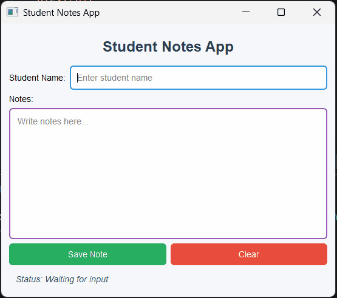

## Task 4 - Style Using QSS

### ✔️ Objective
Improve the visual appearance of the app using `setStyleSheet()` on widgets.

### ✔️ Requirements
Update the Student Notes App from task 3 by adding application styling using **Qt Style Sheets (QSS)**.
Keep all features from task 3 working.
* Use only **QSS styling** (`setStyleSheet()`).
* Apply styling to multiple widgets such as:
    * Main window
    * Title label
    * QLineEdit
    * QTextEdit
    * QPushButton
    * Status label
* Add styles like:
    * Background color
    * Text color
    * Padding
    * Border
    * Border radius
    * Font size
    * Hover effect for buttons
* Use `self.widget.setStyleSheet(...)`
* Do not use:
    * QPalette
    * `setStyle()`
    * Third-party libraries

### ✔️ Learning Goal
By completing this task, you will practice:
* Styling widgets using QSS
* Improving UI design
* Customizing multiple widgets

### ✔️ Sample Output
