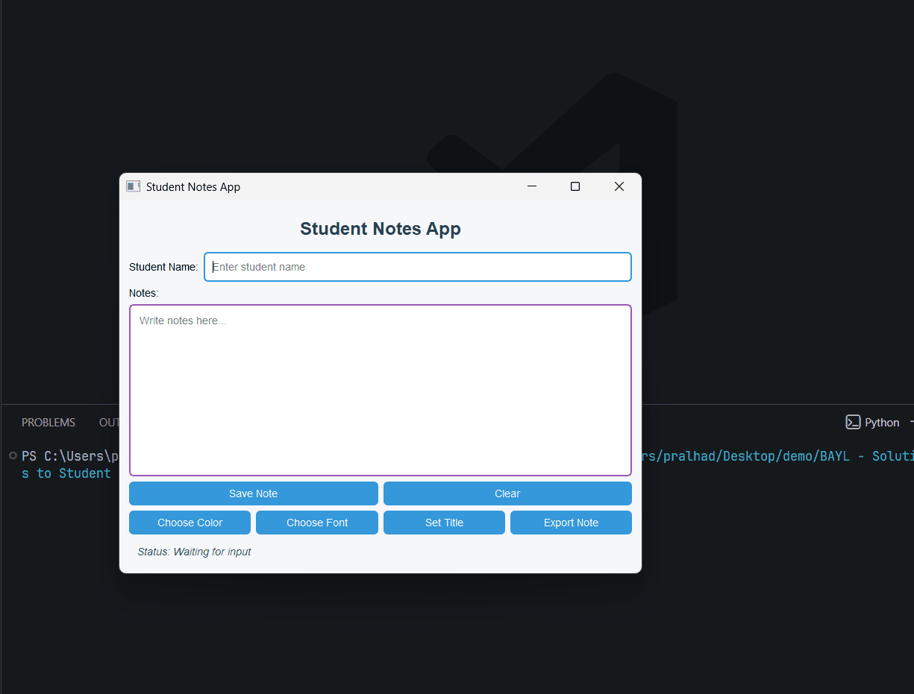

## Task 5 - Add Dialogs

### ✔️ Objective
Use PySide2 dialogs to make the project more interactive and practical.

### ✔️ Requirements
Update the Student Notes App by adding useful built-in dialogs. Keep all previous features working and add the following dialog-based features:
* **Save Note button**
    * Before saving, show a confirmation dialog using `QMessageBox`.
    * If user clicks Yes → save the note.
    * If user clicks No → cancel save.
* **Clear button**
    * Ask confirmation before clearing fields using `QMessageBox`.
* Add new button: **Choose Color**
    * Open `QColorDialog`
    * Change notes area text color.
* Add new button: **Choose Font**
    * Open `QFontDialog`
    * Apply selected font to notes area.
* Add new button: **Set Title**
    * Open `QInputDialog`
    * Let user change the app title text.
* Add new button: **Export Note**
    * Open `QFileDialog`
    * Save notes text into a` .txt `file.
* Use layouts properly to place the new buttons.

### ✔️ Learning Goal
By completing this task, you will practice:
* Using built-in dialogs in PySide2
* Working with `QColorDialog` and `QFontDialog`
* Taking input using dialogs
* Exporting text files

### ✔️ Sample Output
