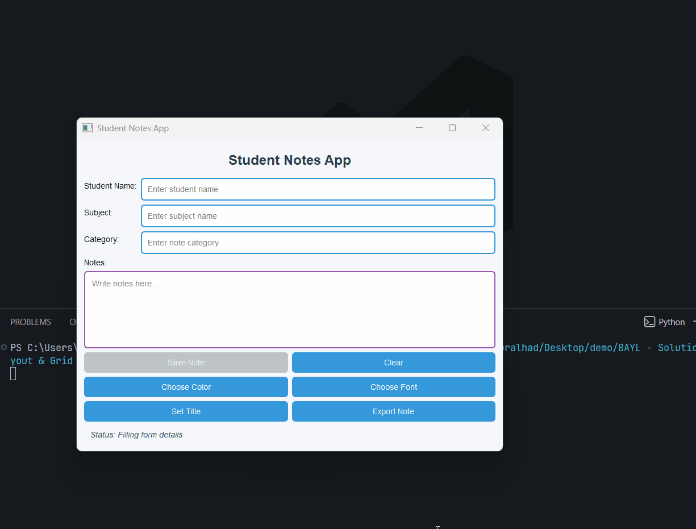

## Task 6 - Add Form Layout & Grid Layout

### ✔️ Objective
Improve the structure of the app by organizing the student information section using a **form layout** and organizing action buttons using a **grid layout**.

### ✔️ Requirements
Update the Student Notes App by using both QFormLayout and QGridLayout in a practical way.
* Keep all previous features working and update the UI as follows:
    * Replace the old student input section with a `QFormLayout`.
    * In the form layout, add:
        * Student Name → `QLineEdit`
        * Subject → `QLineEdit`
        * Notes Category → `QLineEdit`
    * Keep the notes writing area using `QTextEdit`.
    * Replace the old button rows with a **QGridLayout**.
    * Add these buttons inside the grid layout:
        * Save Note
        * Clear
        * Choose Color
        * Choose Font
        * Set Title
        * Export Note
    * The app should still support:
        * Save confirmation dialog
        * Clear confirmation dialog
        * Color dialog
        * Font dialog
        * Input dialog for title
        * File dialog for exporting note
        * Status label updates
        * QSS styling
    * Add small improvements:
        * Save button should only enable when notes are written
        * Exported file should include:
            * Student name
            * Subject
            * Category
            * Notes text

### ✔️ Learning Goal
By completing this task, you will practice:
* Using `QFormLayout`
* Using `QGridLayout`
* Organizing complex UI properly
* Managing multiple input fields

### ✔️ Sample Output
