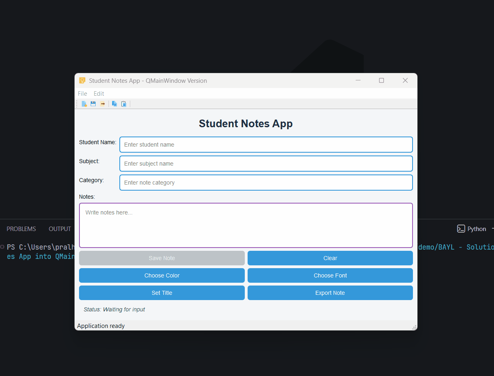

## Task 7 - Convert into QMainWindow

### ✔️ Objective
Refactor the current project so that the entire existing interface becomes the **central widget** of a `QMainWindow`, and extend it with main-window features.

### ✔️ Requirements
Update the Student Notes App by converting it from a `QWidget`-based window into a proper `QMainWindow` application.
* Keep all previous features working and make the following changes:
    * Replace the current `QWidget` window with a class that inherits from `QMainWindow`.
    * Create a separate central `QWidget` and set it using:
        * `self.setCentralWidget(...)`
    * Practice the following `QMainWindow` functions:
        * `setWindowTitle()`
        * `setGeometry()`
        * `resize()`
        * `setWindowIcon()`
    * Add a **menu bar** using `self.menuBar()`.
    * Add a **File** menu with actions such as:
        * New / Clear
        * Export Note
        * Exit
    * Add an **Edit** menu with actions such as:
        * Copy
        * Paste
        * Change Title
    * Add at least one **separator** inside the menus.
    * Create the menu items using QAction.
    * Add:
        * Shortcuts
        * Status tips
        * Icons
    * Use **script-relative paths for all icons**.
        * This means icons should load from the same project folder as the Python file.
        * Search and use icons from google  
        * **Required Icons**
            * app icon
            * copy icon
            * exit icon
            * export icon
            * new icon
            * paste icon
            * save icon
    * Connect menu actions to existing slots.
    * Add a **toolbar** using `QToolBar`.
        * Add some of the same actions into the toolbar.
    * Add and use the status bar of `QMainWindow`.
        * Show status updates there instead of only using the bottom label.
        * You may still keep the label if you want.
    * Keep all previous learning integrated:
        * Form layout
        * Grid layout
        * Dialogs
        * Styling
        * Signals and slots

### ✔️ Learning Goal
By completing this task, you will practice:
* Using `QMainWindow`
* Working with menu bar and toolbar
* Creating actions with shortcuts
* Using status bar messages
* Building a full desktop app structure

### ✔️ Sample Output
