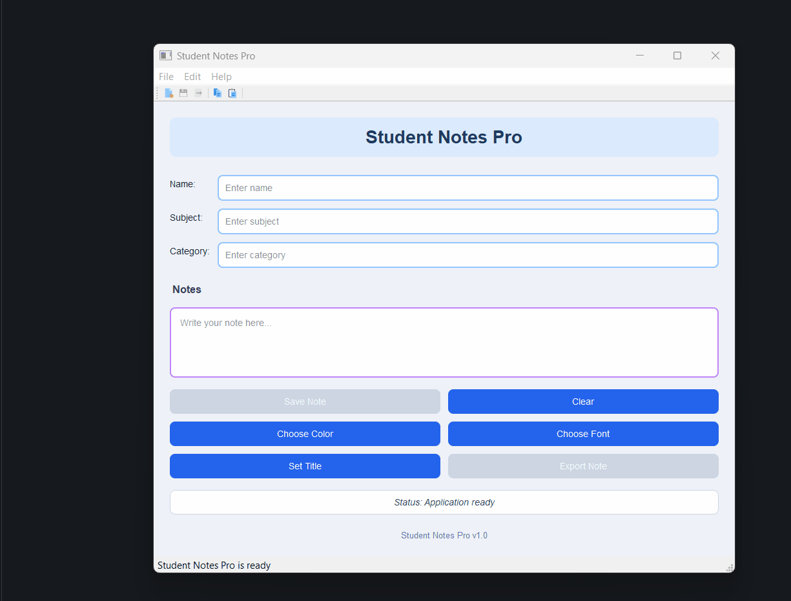

## Task 8 - Final Polish & Release Version

### ✔️ Objective
* This session is about giving the application its **final release look and feel.**
* you should improve the user interface, make the styling more consistent, improve usability, and add one final professional feature: an **About dialog**.

### ✔️ Requirements
Update the current Student Notes App into a more polished and professional final version.
* Keep all existing features working and improve the app with the following final touches:
    * Keep the app as a `QMainWindow`.
    * Keep the existing:
        * Central widget
        * Form layout
        * Grid layout
        * Dialogs
        * Menu bar
        * Toolbar
        * Status bar
        * QSS styling
    * Improve the visual design:
        * Better spacing and margins
        * Better title styling
        * Consistent button styling
        * Better input field styling
        * Better status label styling
        * Better overall background and section appearance
    * Improve usability:
        * Disable Save and Export buttons when note box is empty
        * Update status messages more clearly
        * Show success information after export
        * Add placeholder texts where useful
    * Add a new **About action inside a Help menu.**
        * When clicked, show a `QMessageBox.about()` dialog
        * Display app name, version, and short description
    * Add a footer label inside the main UI showing:
        * `Student Notes Pro v1.0`
    * Rename the application title shown in the UI to:
        * `Student Notes Pro`
    * Keep the project structured cleanly and professionally.

### ✔️ Note
* It is not required for your UI colors, styling, or design to look exactly the same as the given example.
* You can use your own colors, fonts, and styling choices.
* Important:
    * Keep the app structure the same
    * Keep the layout the same
    * Keep all required features working
    * Keep buttons, menus, dialogs, and sections in the correct place

### ✔️ Learning Goal

By completing this task, you will practice:
* UI polishing
* Improving app usability
* Managing enabled and disabled states
* Adding Help menu and About dialog

### ✔️ Sample Output
