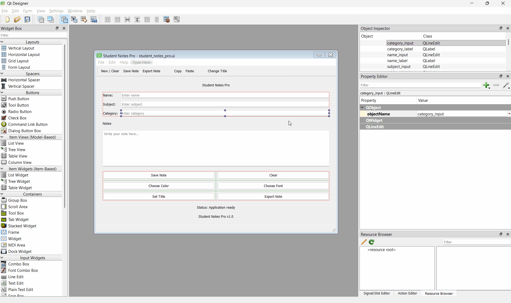

## Task 9 - Create UI Using Qt Designer

### ✔️ Objective
* In this task,
    * Create the final Student Notes Pro UI using Qt Designer only.
    * only design the complete interface visually in Qt Designer and save it as a .ui file.
* **Learning Goal**
    * By completing this task, you will practice: **creating a full UI in Qt Designer**

### ✔️ Requirements
Create the final UI of Student Notes Pro in Qt Designer with the following:
* Use QMainWindow as the main base window.
* Add a central widget.
* Create the main interface of the app, including:
    * Title label
    * Student name input
    * Subject input
    * Category input
    * Notes text area
    * Buttons such as
        * Save Note, Clear, Choose Color, Choose Font, Set Title, Export Note
    * Info/status label inside the UI
    * Footer label
* Add a menu bar with menus like:
    * File
    * Edit
    * Help
* Add a toolbar
* Add a status bar
* Arrange the UI properly using layouts.
* Save the file as a `.ui` file.
#### 📌 Important Naming Requirement
You must **give proper object names to widgets and actions**, because the same names will be used later in Python code.
* For example:
    * Save Note button → object name can be `save_button`
    * Notes text edit → object name can be` notes_box`
    * Title label → object name can be `title_label`
* Similarly, all other widgets should also be given clean and meaningful object names.
* File Submission
    * You should submit: The .ui file created in Qt Designer
* Example Object Naming Reference
```text
Example widget/object naming style:

Window Title Label  -> title_label
Student Name Input  -> name_input
Notes Text Edit     -> notes_box
Save Note Button    -> save_button
Clear Button        -> clear_button
Export Note Button  -> export_button

Example action naming style:

New Action          -> action_new
Save Action         -> action_save
Export Action       -> action_export
Exit Action         -> action_exit
About Action        -> action_about
```

### ✔️ Sample Output
